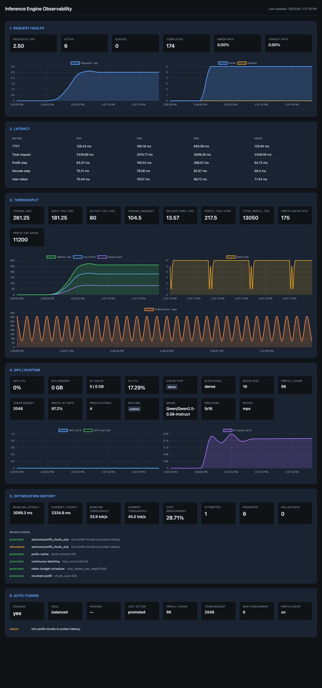

# Inference Engine

Nifre is an open-source self-optimizing inference runtime for single-node LLM serving. It comes with KV-cache, static batching, continuous batching, and a model-agnostic backend interface. A closed-loop auto-tuner continuously observes live metrics, proposes configuration changes, and promotes or rolls them back based on measured impact — so the engine tunes itself to the workload at runtime. Includes a FastAPI server, a reference GPT backend, and a generic Hugging Face backend that runs almost any causal LM (Qwen, Llama, Mistral, GPT-2, ...).

## Features

- **KV cache** — prefill + decode without recomputing past attention
- **Static batching** — run multiple prompts in one forward pass (fixed batch)
- **Continuous batching** — requests join and leave between decode steps
- **Chunked prefill** — long prompts are cached in fixed-size chunks so decode can interleave
- **Paged KV cache** — block-pooled K/V storage with per-sequence block tables (engine default)
- **Prefix caching** — reuse cached K/V across requests that share prompt prefixes, via block-chained hashing for both the custom and HF backends (toggle with `--no-prefix-cache`)
- **Self-improving auto-tuner** — closed loop that observes metrics, classifies the workload, proposes config changes (chunk size, token budget, concurrency), and promotes or rolls back based on measured impact
- **Model-agnostic API** — plug in backends via `InferenceModel` + `Tokenizer`
- **Hugging Face backend** — run any `AutoModelForCausalLM` (Qwen, Llama, Mistral, ...) with `--model hf --hf-model <id>`
- **FastAPI server** — HTTP completions with blocking JSON or SSE streaming (`stream: true`)
- **Observability dashboard** — request health, latency, throughput, GPU/runtime, optimization history

## Project layout

```text
nifre/
├── src/
│   ├── inference/          # Engine, scheduler, server, backends, models
│   │   ├── engine.py
│   │   ├── scheduler.py
│   │   ├── kv_cache.py
│   │   ├── paged_kv_cache.py
│   │   ├── prefix_cache.py
│   │   ├── block_allocator.py
│   │   ├── block_table.py
│   │   ├── model_runner.py
│   │   ├── attention.py     # Model-agnostic attention over the KV cache
│   │   ├── server.py
│   │   ├── models/         # Model definitions (gpt.py, layers.py)
│   │   └── backends/       # Model adapters (hf, gpt)
│   ├── generate.py         # Static-batched CLI
│   ├── bench.py            # Synthetic load generator for auto-tune / perf testing
│   ├── compare.py          # Engine-agnostic A/B harness (nifre vs vLLM)
│   ├── autotune/           # Classifier, policy, controller, admin API
│   ├── sampler.py          # Greedy sampling helper
│   └── observability/      # Metrics, dashboard, optimization tracking
│       ├── metrics_store.py
│       ├── collector.py
│       ├── runtime_probe.py
│       ├── optimization.py
│       └── dashboard/      # FastAPI dashboard UI
├── tests/                  # Smoke tests
└── requirements.txt
```

Set `PYTHONPATH` so the `inference` package resolves:

```bash
export PYTHONPATH=src
```

## Setup

```bash
cd nifre
python3 -m venv venv
source venv/bin/activate
pip install -r requirements.txt
```

### Checkpoint (optional)

For sensible text output, place a trained checkpoint at:

```text
src/checkpoints/gpt_model_checkpoint.pt
```

Expected format:

```python
{
    "config": {...},           # GPT config dict
    "model_state_dict": {...}
}
```

Without a checkpoint, the server falls back to **random weights** (output will be gibberish, but the pipeline still runs).

## Run tests

```bash
PYTHONPATH=src python3 -m tests
```

## FastAPI server

Start the server (loads Hugging Face `gpt2` by default):

```bash
PYTHONPATH=src python3 -m inference.server \
  --model hf \
  --hf-model gpt2 \
  --context-length 256 \
  --port 8000 \
  --max-concurrent 2
```

The custom PyTorch GPT backend is still available with `--model gpt` and an optional checkpoint.

### Running any Hugging Face model (Qwen, Llama, Mistral, ...)

The **`hf`** backend runs almost any `AutoModelForCausalLM` — just pass a Hub model id with `--hf-model`. Architecture-specific details (RoPE, GQA, learned vs. rotary positions) are handled inside the HF model, so no per-model code is needed.

```bash
# Qwen
PYTHONPATH=src python3 -m inference.server \
  --model hf \
  --hf-model Qwen/Qwen2.5-0.5B-Instruct \
  --context-length 2048 \
  --max-concurrent 2

# Llama (gated — run `huggingface-cli login` first)
PYTHONPATH=src python3 -m inference.server \
  --model hf \
  --hf-model meta-llama/Llama-3.2-1B-Instruct \
  --context-length 2048

# Small Llama-architecture model (no auth, good for a quick test)
PYTHONPATH=src python3 -m inference.server \
  --model hf \
  --hf-model HuggingFaceTB/SmolLM2-135M \
  --context-length 2048
```

Then call it exactly like any other backend:

```bash
curl -s http://127.0.0.1:8000/v1/completions \
  -H 'Content-Type: application/json' \
  -d '{"prompt": "The capital of France is", "max_new_tokens": 16}'
```

Notes:

- **Weights** download from the Hugging Face Hub on first run (cached afterwards). Gated models (e.g. Llama) require `huggingface-cli login` or a `HF_TOKEN`.
- **Tokenizer** is the model's own HF tokenizer (`AutoTokenizer`).
- **`--context-length`** caps the KV cache length (clamped to the model's `max_position_embeddings`). Raise it for long prompts; higher values use more memory.
- **Caching for HF models** — the `hf` backend uses Hugging Face's own `past_key_values` cache and gets these benefits:
  - **Prefix caching: yes.** Shared prompt prefixes are reused across requests (see [Prefix caching](#prefix-caching)). Enabled by default; toggle with `--no-prefix-cache`.
  - **Auto-tuning: yes.** Chunked prefill, token-budget scheduling, and concurrency are tuned exactly as for the custom backend.
  - **Block-paged KV cache: no** (by design). nifre's block paging replaces the attention kernel, which HF owns. HF's cache already grows on demand (no fixed pre-allocation), so paging's anti-fragmentation win is moot, and the cross-request-sharing win is delivered by prefix caching instead. See [HF cache trade-offs](#why-hf-models-dont-use-block-paged-kv-cache).

Or with uvicorn:

```bash
PYTHONPATH=src uvicorn inference.server:app --host 127.0.0.1 --port 8000
```

Interactive API docs: [http://127.0.0.1:8000/docs](http://127.0.0.1:8000/docs)

The server starts a background **EngineWorker** on launch. HTTP handlers submit requests via `generate` / `generate_stream` on the worker; a single thread owns `engine.step()` so concurrent clients batch safely.

### Endpoints

**Health**

```bash
curl -s http://127.0.0.1:8000/health | python3 -m json.tool
```

**Completions (non-streaming, default)**

Omit `stream` or set `"stream": false` to receive one JSON response when generation finishes. The response follows the OpenAI **text_completion** shape:

```bash
curl -s -X POST http://127.0.0.1:8000/v1/completions \
  -H "Content-Type: application/json" \
  -d '{"prompt": "Every effort moves you", "max_new_tokens": 20}' \
  | python3 -m json.tool
```

Example response:

```json
{
  "id": "cmpl-abc123",
  "object": "text_completion",
  "created": 1700000000,
  "model": "gpt",
  "choices": [
    {
      "text": " ...generated text only...",
      "index": 0,
      "logprobs": null,
      "finish_reason": "length"
    }
  ],
  "usage": {
    "prompt_tokens": 4,
    "completion_tokens": 20,
    "total_tokens": 24
  }
}
```

**Completions (streaming SSE, OpenAI-compatible)**

Set `"stream": true` to receive Server-Sent Events in OpenAI streaming format:

```bash
curl -N -X POST http://127.0.0.1:8000/v1/completions \
  -H "Content-Type: application/json" \
  -d '{"prompt": "Every effort moves you", "max_new_tokens": 20, "stream": true}'
```

Example events:

```text
data: {"id":"cmpl-abc123","object":"text_completion","created":1700000000,"model":"gpt","choices":[{"text":" hello","index":0,"logprobs":null,"finish_reason":null}]}

data: {"id":"cmpl-abc123","object":"text_completion","created":1700000000,"model":"gpt","choices":[{"text":" world","index":0,"logprobs":null,"finish_reason":"length"}]}

data: [DONE]
```

Optional request field `"model"` overrides the model name echoed in responses (defaults to the loaded backend).

### Server options

| Flag | Default | Description |
|------|---------|-------------|
| `--model` | `hf` | Registered backend name (`hf` = any HF model, or `gpt`) |
| `--hf-model` | `gpt2` | Hugging Face model id (for the `hf` backend) |
| `--context-length` | `256` | Max KV-cache context (clamped to the model's max positions) |
| `--checkpoint` | `src/checkpoints/gpt_model_checkpoint.pt` | Weights path (custom `gpt` backend only) |
| `--max-concurrent` | `2` | Max concurrent requests (cache slots) |
| `--no-prefix-cache` | off | Disable prefix caching (reuse of shared prompt prefixes) |
| `--no-paged-kv-cache` | off | Disable the block-paged KV cache (custom `gpt` backend only) |
| `--host` | `127.0.0.1` | Bind address |
| `--port` | `8000` | Port |

## Chunked prefill

Long prompts are no longer processed in a single prefill forward. Each request caches its prompt in chunks (default **128 tokens** per step), staying in `PREFILL` until `prefill_offset` reaches the prompt length. That lets other requests decode between chunks.

```text
Request A (long prompt):  PREFILL chunk → PREFILL chunk → DECODE…
Request B (short prompt):           PREFILL → DECODE…  (interleaved with A)
```

### Configuration

Set chunk size when constructing the engine:

```python
engine = Engine(
    model,
    max_concurrent_requests=2,
    device=device,
    prefill_chunk_size=512,
    max_tokens_per_step=1024,
)
```

`add_request()` copies `Engine.prefill_chunk_size` onto each `InferenceRequest`. Short prompts still complete in one step when `len(prompt) <= prefill_chunk_size`.

### Token budget (`max_tokens_per_step`)

Each `engine.step()` caps total tokens processed in that step (default **2048**). The scheduler uses **decode-first** ordering:

1. Add decode requests (1 token each) until budget is exhausted
2. Add prefill chunks (`min(prefill_chunk_size, prompt remaining)`) for remaining budget

Requests that do not fit are deferred to the next step. This smooths latency under load when many prefills and decodes are active.

### Lifecycle

| Step | What happens |
|------|----------------|
| `model_runner.prefill` | Processes `prompt[offset : offset + chunk_size]`, advances `prefill_offset` |
| Intermediate chunk | Returns `None`; request stays in `PREFILL` |
| Final chunk | Returns first sampled token; engine calls `mark_prefill_done` |
| `scheduler.mark_prefill_done` | Requires `prefill_complete`; transitions to `DECODE` |

### Tests

Chunking is covered in `tests/test_model_runner.py` and `tests/test_scheduler.py`.

## Paged KV cache

The engine uses **PagedKVCache** by default (`use_paged_kv_cache=True`). Physical K/V memory is split into fixed-size **blocks** managed by a shared `BlockAllocator`. Each sequence has a `BlockTable` that maps logical token positions to physical block IDs.

```text
BlockAllocator (shared pool)
  ├── Block 0  →  K/V tensors at index 0, all layers
  ├── Block 1  →  K/V tensors at index 1, all layers
  └── ...

Slot 0 BlockTable:  [physical 3] [physical 7]     →  tokens 0–7, 8–15
Slot 1 BlockTable:  [physical 1]                  →  tokens 0–7
```

Blocks use **reference counting** (`retain` / `release`) so the same physical block can be shared safely (e.g. by the prefix cache and multiple sequences).

Disable paging to use the dense per-slot `KVCache`:

```python
engine = Engine(model, max_concurrent_requests=2, device=device, use_paged_kv_cache=False)
```

`ModelConfig.block_size` (default **16**) controls how many tokens fit in each block. GPT backends read `block_size` from the model config dict when present.

## Prefix caching

When many requests share the same prompt prefix (system prompts, RAG context, few-shot examples), prefix caching skips redundant prefill work by reusing already-computed K/V blocks.

```text
Request 1: [system prompt 16 tok] + [user A]
  → full prefill → register_prefix() stores blocks in PrefixCache

Request 2: [same system prompt 16 tok] + [user B]
  → try_load_prefix() hits 16 tokens → prefill only [user B]
```

Prefix caching works for **both** backends, via the same engine hooks (`register_prefix` / `try_load_prefix`), with two implementations:

### Custom `gpt` backend — block-level

1. **Block-chained hashing** — each full block of `block_size` tokens is keyed by `(parent_hash, block_tokens)`. Lookup walks the chain and returns the longest cached prefix.
2. **On prefill complete** — `PagedKVCache.register_prefix()` inserts the prompt's full blocks into the cache and retains them (shared via reference counting).
3. **On new request** — `ModelRunner` calls `try_load_prefix()` before resetting the slot. On a hit, `prefill_offset` starts after the cached prefix.
4. **On request finish** — the slot's block table is cleared; cached blocks stay alive via the prefix cache's references.

Only **full blocks** are cached (`len(prompt) // block_size`). A 20-token prompt with `block_size=16` caches one block (16 tokens).

### `hf` backend — block-chained (same hashing as the paged path)

HF models keep a dense `past_key_values`, but `HFKVCache` still reuses it at **block granularity** using the same block-chained hashing as `PrefixCache`:

1. **On prefill complete** — the prompt is split into full blocks of `block_size`; each block is keyed by `(parent_hash, block_tokens)` and its per-layer K/V slice is stored once. Shared prefix blocks hash to the same key, so they are **not duplicated in memory**.
2. **On new request** — the chain is walked block-by-block and stops at the first miss (leaving ≥1 token for the forward pass). Matched block slices are concatenated back into a `DynamicCache` for the slot.
3. LRU eviction on the block map (`prefix_cache_max_entries`, default 1024).

Reusing cached K/V is numerically identical to recomputing them, so **outputs are unchanged** — enforced by `test_hf_prefix_cache_reuses_shared_prefix_without_changing_output`.

**Metrics** — the HF prefix cache reports `hits`, `misses`, `hit_rate`, `tokens_reused`, `entries`, `memory_mb`, and `avg_lookup_ms` (via `HFKVCache.prefix_stats()`, surfaced under `gpu_runtime.engine_config.prefix_cache` in the observability snapshot). The throughput block also exposes `prefix_cache_reuse_ratio` = reused ÷ (reused + prefilled) tokens — the number that actually matters.

### Configuration

```python
engine = Engine(
    model,
    max_concurrent_requests=4,
    device=device,
    use_paged_kv_cache=True,   # custom gpt backend only; ignored by hf
    use_prefix_cache=True,     # default; works for both gpt and hf
)
```

Toggle from the server with `--no-prefix-cache`. The block-level cache (custom backend) defaults to **1024 entries**; the HF token-level cache defaults to **128 snapshots** — both LRU-evicted.

### Why HF models don't use block-paged KV cache

nifre's block paging is implemented **inside** its own attention kernel (`inference/attention.py`), which reads/writes fixed-size K/V blocks. Hugging Face models bring their own attention kernels and manage a dense `past_key_values` cache, so there is no seam to plug block paging into without reimplementing each architecture (RoPE, GQA, ...) the way vLLM does. That's out of scope here — but the two practical wins of paging are still covered for HF:

- **Memory efficiency / no over-allocation** — HF's `DynamicCache` already grows on demand, so it never pre-allocates `max_seq_len` per slot the way nifre's non-paged `KVCache` does.
- **Cross-request sharing** — delivered by the token-level prefix cache above.

So HF-backed models get prefix caching + full auto-tuning; only the block-pool memory layout is backend-specific.

### Example: shared system prompt

```python
system = tokenizer.encode("You are a helpful assistant. " * 10)
q1 = system + tokenizer.encode("What is Python?")
q2 = system + tokenizer.encode("What is Rust?")

engine.generate(q1, max_new_tokens=20)
engine.generate(q2, max_new_tokens=20)
# Second request skips prefill for the shared system tokens.
```

### Tests

Prefix caching is covered in `tests/test_prefix_cache.py`, `tests/test_paged_kv_cache.py`, and `tests/test_block_allocator.py`.

## Observability dashboard

The inference server ships with a built-in observability dashboard. Start the server as usual, then open:

**Dashboard:** [http://127.0.0.1:8000/observability](http://127.0.0.1:8000/observability)

**Metrics API:**

```bash
curl -s http://127.0.0.1:8000/observability/api/metrics | python3 -m json.tool
```

### Dashboard sections

| Section | Metrics |
|---------|---------|
| **Request health** | requests/sec, active, queued, completed, error rate, timeout rate |
| **Latency** | TTFT, total latency, prefill/decode step latency, inter-token latency (P50/P95/P99) |
| **Throughput** | tokens/sec, input/output tokens/sec, tokens/request, prefill tokens/step, prefix cache hits & tokens saved |
| **GPU / runtime** | GPU util & memory, KV cache memory & utilization, cache type, block pool, prefix cache hit rate |
| **Optimization history** | baseline vs current latency/throughput, cost improvement, attempted/promoted/rolled back |

### Standalone dashboard (optional)

Poll metrics from a running inference server on a separate port:

```bash
PYTHONPATH=src python3 -m observability.dashboard.server \
  --port 9090 \
  --metrics-url http://127.0.0.1:8000/observability/api/metrics
```

### Record optimization events (Python)

```python
from observability import Observability

obs = Observability(model_name="gpt", runtime="custom")
obs.attach(engine)  # auto-records promotions for paged-kv-cache, prefix-cache, chunked-prefill, etc.

obs.optimization.record_attempt("continuous-batching", details="enabled scheduler v2")
obs.optimization.record_promotion("continuous-batching")
obs.optimization.record_rollback("fp8-kv-cache", details="accuracy regression")
```

## Static batching CLI

The reference GPT model also supports static batched generation (no continuous scheduler):

```bash
PYTHONPATH=src python3 -m generate \
  --prompt "Every effort moves you" \
  --prompt "The cat sat on the mat" \
  --max-new-tokens 20
```

## Use the engine in Python

```python
import torch
from pathlib import Path

from inference.backends.registry import load_backend
from inference.engine import Engine
from generate import get_device

device = get_device()
checkpoint = Path("src/checkpoints/gpt_model_checkpoint.pt")

model, tokenizer = load_backend(
    "gpt",
    checkpoint if checkpoint.exists() else None,
    device,
)

engine = Engine(
    model,
    max_concurrent_requests=2,
    device=device,
    use_paged_kv_cache=True,
    use_prefix_cache=True,
)

# Single blocking request
token_ids = tokenizer.encode("Every effort moves you")
result = engine.generate(token_ids, max_new_tokens=20)
print(tokenizer.decode(result.prompt_token_ids + result.output_token_ids))

# Streaming request (token-by-token)
for token_id in engine.generate_stream(token_ids, max_new_tokens=20):
    print(tokenizer.decode([token_id]), end="", flush=True)
print()

# Or queue multiple requests and step manually
engine.add_request(tokenizer.encode("Hello"), max_new_tokens=10)
engine.add_request(tokenizer.encode("The quick brown fox"), max_new_tokens=10)
engine.run_until_done()

for req in engine.get_completed().values():
    print(tokenizer.decode(req.prompt_token_ids + req.output_token_ids))
```

## Architecture

```text
Client
  → FastAPI server (server.py)
    → EngineWorker (background step loop)
      → Engine (scheduler + KV cache lifecycle)
        → ModelRunner (prefill / decode forwards, prefix cache lookup)
          → InferenceModel backend (e.g. GPT)
            → Attention reads/writes PagedKVCache or KVCache
```

| Component | Role |
|-----------|------|
| **EngineWorker** | Single thread owns ``engine.step()``; HTTP handlers submit via ``generate`` / ``generate_stream`` |
| **Scheduler** | Queue, batch slots, token budget per step (decode-first), enforces `prefill_complete` |
| **Engine** | Owns cache, calls scheduler + model runner each step; configures chunking and prefix cache |
| **ModelRunner** | Batched prefill chunks + decode forwards; `try_load_prefix` on slot prep |
| **KVCache** | Dense per-slot storage (optional via `use_paged_kv_cache=False`) |
| **PagedKVCache** | Block-pooled K/V storage with `BlockAllocator` + `BlockTable` per slot (engine default) |
| **PrefixCache** | Block-chained hash map from token prefixes to shared physical blocks |
| **BlockAllocator** | Physical block pool with reference counting for shared blocks |
| **Backend** | Weights, tokenizer, cache-aware forward |

## Adding a new model backend

1. Implement `InferenceModel` — expose `.config` and a cache-aware `__call__` returning logits.
2. Implement `Tokenizer` — `encode`, `decode`, `pad_token_id`.
3. Add `load_my_backend()` in `src/inference/backends/my_model.py`.
4. Register it in `src/inference/backends/registry.py`:

```python
BACKENDS = {
    "gpt": load_gpt_backend,
    "my_model": load_my_backend,
}
```

5. Run: `python3 -m inference.server --model my_model`

See `src/inference/model_interface.py` and `src/inference/backends/gpt.py` for the reference adapter.

## Auto-tuning

The embedded auto-tuner observes metrics, classifies workload, proposes config changes, and promotes or rolls back after an evaluation window.

**Start with auto-tune enabled:**

```bash
PYTHONPATH=src python3 -m inference.server \
  --auto-tune \
  --tuning-goal balanced \
  --tuning-interval 30 \
  --tuning-evaluation 60
```

**Admin API** (also available when observability is enabled):

```bash
curl http://127.0.0.1:8000/v1/admin/tuning
curl -X POST http://127.0.0.1:8000/v1/admin/tuning \
  -H 'Content-Type: application/json' \
  -d '{"enabled": true, "goal": "latency"}'
```

The observability dashboard includes an **Auto-Tuning** panel (`/observability`) showing goal, pending attempt, last action, and live engine config.

### Results: auto-tuning a Hugging Face model

Live run of the `hf` backend serving **Qwen2.5-0.5B-Instruct** on Apple Silicon (MPS, fp16), auto-tune on (`balanced` goal), under the `rag` profile (6 concurrent clients, shared prompt prefix):

```bash
# server
PYTHONPATH=src python3 -m inference.server \
  --model hf --hf-model Qwen/Qwen2.5-0.5B-Instruct \
  --context-length 512 --max-concurrent 6 \
  --auto-tune --tuning-goal balanced --tuning-interval 10 --tuning-evaluation 12

# load
PYTHONPATH=src python3 -m bench --profile rag --duration 120 --concurrency 6 --max-new-tokens 32
```



What the dashboard shows for this run:

| Metric | Value |
|--------|-------|
| Requests completed | 306 / 306 (0 errors) |
| Throughput | ~261–272 tokens/sec |
| TTFT p95 | 87 ms |
| Auto-tune cost improvement | **+28.7%** (baseline 33.9 → 45.0 tok/s; latency 3099 → 2334 ms) |
| Optimizations promoted / rolled back | 6 / 0 |
| Auto-tune action | promoted `prefill_chunk_size` 128 → 96 ("trim prefill chunks to protect latency") |
| Prefix-cache hit rate | **97.2%** (304 hits / 309 lookups) |
| Prefix tokens reused | 19,456 (reuse ratio ≈ 0.47) |
| Prefix-cache blocks stored | **4** (0.75 MB) — shared blocks deduplicated across all requests |

The last two rows are the payoff of the block-chained HF prefix cache: hundreds of requests share the same ~4-block prefix, which is stored **once**, while the auto-tuner independently trims prefill chunk size to protect latency under load.

## Benchmark workloads

Generate synthetic traffic against a running server (useful before enabling auto-tune):

```bash
# Terminal 1 — server
PYTHONPATH=src python3 -m inference.server --max-concurrent 4

# Terminal 2 — benchmark
PYTHONPATH=src python3 -m bench --profile chat --duration 30 --concurrency 4
PYTHONPATH=src python3 -m bench --profile rag --duration 30
PYTHONPATH=src python3 -m bench --profile batch --duration 30
```

Profiles:

| Profile | Simulates |
|---------|-----------|
| `chat` | Short prompts, moderate concurrency |
| `rag` | Long shared prefix + short question suffixes (prefix-cache friendly) |
| `batch` | Many unique prompts |

## Comparing nifre vs vLLM (same weights)

Both engines should use **Hugging Face `gpt2`** (124M). nifre loads it natively via the `hf` backend (same `transformers` model vLLM uses):

**nifre** (port 8000):

```bash
PYTHONPATH=src python3 -m inference.server \
  --model hf \
  --hf-model gpt2 \
  --context-length 256 \
  --max-concurrent 4
```

**vLLM** (port 8001) — same model id and context cap:

```bash
vllm serve gpt2 --host 127.0.0.1 --port 8001 --max-model-len 256
```

Use the same prompts. Greedy decode on a fixed prompt should match between engines before benchmarking throughput.

| Setting | nifre | vLLM |
|---------|-------|------|
| Weights | `gpt2` via `--model hf` | `gpt2` |
| Context | `--context-length 256` | `--max-model-len 256` |
| Tokenizer | HF GPT-2 (`transformers`) | HF GPT-2 tokenizer |

### Automated A/B harness

`compare.py` drives both servers with identical prompts and load and measures **client-side** latency and throughput (from each response's `usage.completion_tokens`), so the comparison is engine-agnostic:

```bash
PYTHONPATH=src python3 -m compare \
  --a-url http://127.0.0.1:8000 --a-label nifre \
  --b-url http://127.0.0.1:8001 --b-label vllm \
  --profile rag --duration 60 --concurrency 8 --max-new-tokens 64
```

It prints tokens/sec, avg/p95 latency, and an A/B ratio (>1.0 favors A). vLLM is CUDA-only, so run this on a GPU (e.g. RunPod), not on Apple Silicon/MPS.

### Running the comparison on a RunPod (CUDA) GPU

```bash
# 1. In the nifre repo (CUDA is auto-detected by get_device):
pip install -r requirements.txt
pip install vllm

# 2. Terminal A — nifre (custom paged backend, or --model hf for HF weights):
PYTHONPATH=src python3 -m inference.server \
  --model hf --hf-model Qwen/Qwen2.5-0.5B-Instruct \
  --context-length 2048 --max-concurrent 16 \
  --auto-tune --tuning-goal throughput --port 8000

# 3. Terminal B — vLLM, same model + context:
vllm serve Qwen/Qwen2.5-0.5B-Instruct --port 8001 --max-model-len 2048

# 4. Terminal C — A/B:
PYTHONPATH=src python3 -m compare \
  --a-url http://127.0.0.1:8000 --a-label nifre \
  --b-url http://127.0.0.1:8001 --b-label vllm \
  --profile rag --duration 60 --concurrency 16 --max-new-tokens 64
```

Expect vLLM to lead on raw tokens/sec (fused paged-attention CUDA kernels + CUDA graphs); nifre's differentiators are the self-improving auto-tuner and comparable prefix-cache hit rates. Prefix-cache hit rate is the most apples-to-apples metric — check nifre's `/observability` panel against vLLM's `/metrics`.

### Custom GPT backend + weight import (optional)

If you want to benchmark nifre's **custom** PyTorch GPT implementation with the same HF weights, import once:

```bash
PYTHONPATH=src python3 -m inference.backends.import_hf_gpt2 \
  --model gpt2 \
  --context-length 256 \
  --output src/checkpoints/gpt2_hf_checkpoint.pt
```

Then run with `--model gpt --checkpoint src/checkpoints/gpt2_hf_checkpoint.pt`.

## What is not included yet

- Global block pool oversubscription (admission control when pool is full)
- Fused paged-attention GPU kernels
- Production auth, rate limits, or multi-GPU serving
- Quantization

These are natural next steps after the core engine is solid.
